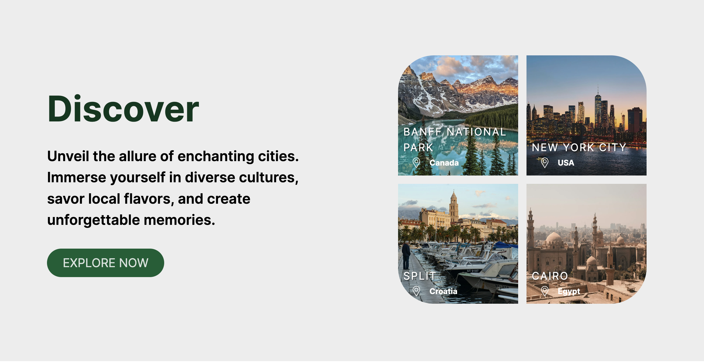
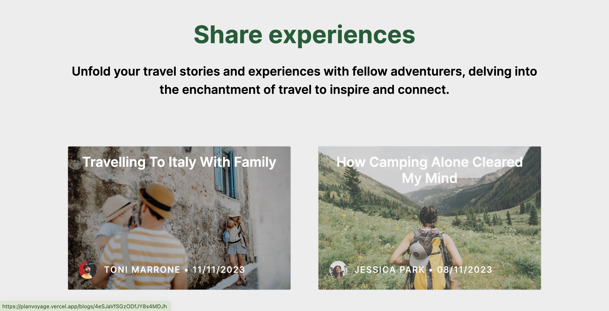
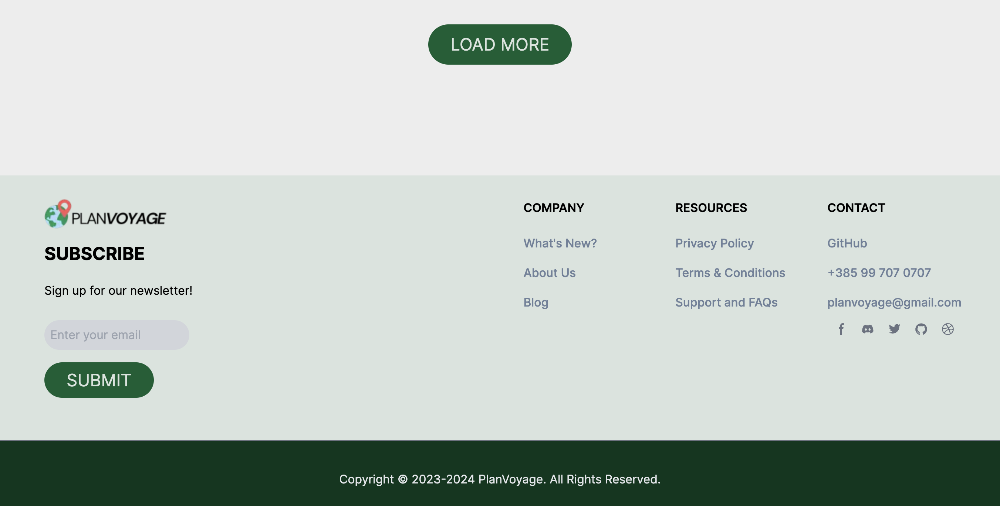

# PlanVoyage 🌍

PlanVoyage is a travel web app that displays posts about various destinations and travel blogs. The app fetches data dynamically from **Contentful**, making it easy to update and manage content without redeploying. Whether you're a travel enthusiast or a casual explorer, PlanVoyage provides a seamless way to discover and plan your next adventure.

This is a [Next.js](https://nextjs.org/) project bootstrapped with [`create-next-app`](https://github.com/vercel/next.js/tree/canary/packages/create-next-app).

## 🚀 Live Demo

Check out the deployed version of the app: [PlanVoyage on Vercel](https://planvoyage.vercel.app/)

## 📚 Project Details

This app was created as part of a class project with [@mnovok](https://github.com/mnovok). For detailed documentation and planning of this project, visit the Notion page: [HCI Projekt - PlanVoyage](https://hciplanvoyage.notion.site/HCI-Projekt-PlanVoyage-35c4aebf467247f29ce52c58a72cb403)

## 📸 Screenshots

### **Homepage**
The landing page introduces the app with a clean and modern design, showcasing its core features.

<div align="center">
  
  
  
  
  
</div>

### **Destinations**
Explore detailed posts about various destinations to inspire your next adventure. Each post includes vibrant images and engaging descriptions, making it easy to plan your travels.

<div align="center">
  
  
</div>

### **Blogs**
Discover engaging blog posts that provide travel tips, destination guides, and personal stories to make your journeys unforgettable.

<div align="center">
  
  
</div>

### **Search and Explore**
Quickly search and explore destinations to find the perfect places for your next adventure.

<div align="center">
  
</div>

## ✨ Features

- **Search Destinations**: Explore locations with ease.
- **Travel Blogs**: Read engaging blog posts with travel tips, guides, and personal stories.
- **User-Friendly Interface**: Intuitive and minimalistic design for a smooth user experience.
- **Responsive Design**: Works seamlessly on all devices.

## 🛠️ Technologies Used

- **Frontend**: [Next.js](https://nextjs.org/) - A React-based framework for building modern web applications.
- **Content Management**: [Contentful](https://www.contentful.com/) - A headless CMS for managing posts and destination data.
- **Deployment**: [Vercel](https://vercel.com/) - Hosting and deployment for serverless applications.
- **Styling**: CSS and Tailwind CSS for a sleek and responsive design.

## 📖 How to Run Locally

1. Clone the repository:
   ```bash
   git clone https://github.com/<your-username>/planvoyage.git
   cd planvoyage 
